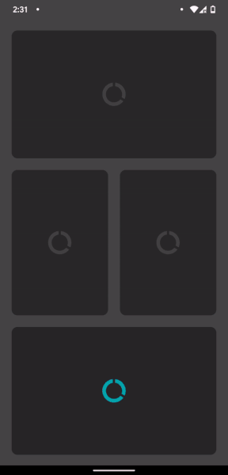

# ImageLoaderView


An `ImageView` with cool loading effects eg: Shimmer. The library is backward compatible to API 19.

I had to built something similar for my client, this one is the complete version of the prototype.



### Why you need this?

Having an effect (shown in gif) requires multiple views to be laid out. For eg: to achieve the Shimmer effect with this [library](https://github.com/facebook/shimmer-android/), you can wrap your `ImageView` inside the `ShimmerFrameLayout` (which it provides) & also the overlay `ImageView` (with circular data-usage icon), you already took 3 layout passes to draw the same thing. In places like `RecyclerView` where each draw calls are expensive we must optimize it.

This view draws everything in one layout pass & also manage the animation states which would unnecessarily increase boiler-plate if done manually.

## Usage

The repository contains the [sample](sample/) project which is basically the above demo (gif) in action.

```xml
<com.kpstv.imageloaderview.ImageLoaderView
    android:id="@+id/imageloaderview"
    android:layout_width="..."
    android:layout_height="..." />
```

- #### Create a shimmer load effect

```xml
<com.kpstv.imageloaderview.ImageLoaderView
   ...
   app:shimmering="true"
   app:corner_radius="10dp"
   app:overlay_drawable="@drawable/..."
   app:overlay_drawable_tint="?attr/colorControlNormal" />
```

- #### Create overlay tinting effect

```xml
<com.kpstv.imageloaderview.ImageLoaderView
   ...
   app:overlay_tinting="true"
   app:backgroundColor="@color/..."
   app:corner_radius="10dp"
   app:overlay_drawable="@drawable/..."
   app:overlay_drawable_tint="@color/fromcolor"
   app:overlay_drawable_secondary_tint="@color/tocolor" />
```

- Once your image is loaded call any of the `setImage**` methods with `animationType` property to `ImageView.CIRCLE_IN` to get the above shown effect, (see example [here](https://github.com/KaustubhPatange/ImageLoaderView/blob/0580871393d0d435d467814dc73f53b481be538e/sample/src/main/java/com/kpstv/imageloaderview_sample/MainActivity.kt#L34)).

- If you don't want a load effect & just directly want to set image onto the view then don't set `animationType` property, but make sure to call `imageview.stopAllSideEffects()` which will make sure to draw your image on top, (example [here](https://github.com/KaustubhPatange/ImageLoaderView/blob/0580871393d0d435d467814dc73f53b481be538e/sample/src/main/java/com/kpstv/imageloaderview_sample/MainActivity.kt#L41-L42).)

Following are the parameters you can optionally specify when inflating this class through XML. All this attributes have their equivalent property methods (Java beans) which can be called programmatically.

| Attributes                            | Type                 |                                                                                                                               |
| ------------------------------------- | -------------------- | ----------------------------------------------------------------------------------------------------------------------------- |
| `app:backgroundColor`                 | `color`              | Sets the background color of the view, default `Color.Gray`. Do not use `android:background` as it messes with corner radius. |
| `app:anim_duration`                   | `long`               | Defines how long the animation should run, default `1200L`.                                                                   |
| `app:corner_radius`                   | `dimension`          | Sets the corner radius of the view.                                                                                           |
| `app:overlay_drawable`                | `reference`, `color` | Sets the overlay drawable display on top of the view.                                                                         |
| `app:overlay_drawable_padding`        | `dimension`          | Sets the padding for the overlay drawable.                                                                                    |
| `app:overlay_drawable_tint`           | `color`              | Sets the tint for the overlay drawable.                                                                                       |
| `app:overlay_drawable_secondary_tint` | `color`              | Sets the secondary tint for overlay drawable. This is basically used for _overlayTintAnimation_.                              |
| `app:overlay_tinting_duration`        | `long`               | Sets the duration for how long the tint animation to be played.                                                               |
| `app:overlay_tinting`                 | `bool`               | Sets whether the view should start tinting animation immediately after laid out.                                              |
| `app:ripple_color`                    | `color`              | Sets the ripple when the view is clickable.                                                                                   |
| `app:selectable`                      | `bool`               | Sets whether the view should receieve touch events like click.                                                                |
| `app:shimmering`                      | `bool`               | Sets whether the view should start shimmering immediately after laid out.                                                     |

## Download

Library is available at `MavenCentral()`.

```groovy
implementation 'io.github.kaustubhpatange:imageloaderview:<version>'
```

## License

- [The Apache License Version 2.0](https://www.apache.org/licenses/LICENSE-2.0.txt)

```
Copyright 2020 Kaustubh Patange

Licensed under the Apache License, Version 2.0 (the "License");
you may not use this file except in compliance with the License.
You may obtain a copy of the License at

   https://www.apache.org/licenses/LICENSE-2.0

Unless required by applicable law or agreed to in writing, software
distributed under the License is distributed on an "AS IS" BASIS,
WITHOUT WARRANTIES OR CONDITIONS OF ANY KIND, either express or implied.
See the License for the specific language governing permissions and
limitations under the License.
```
